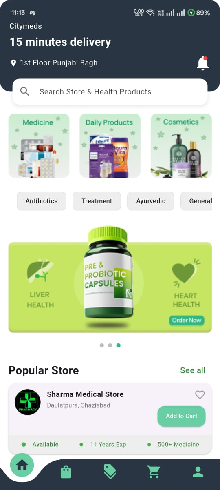
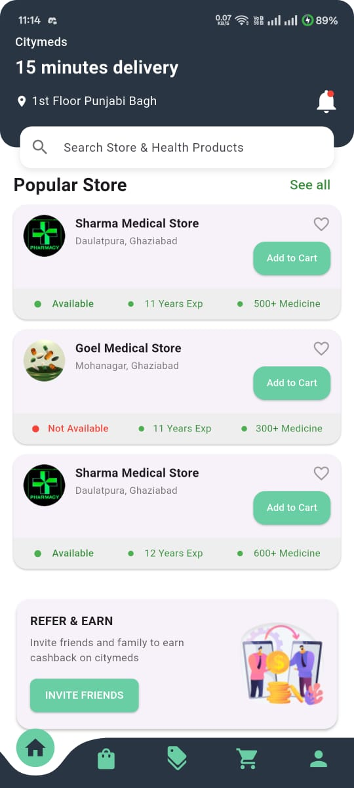
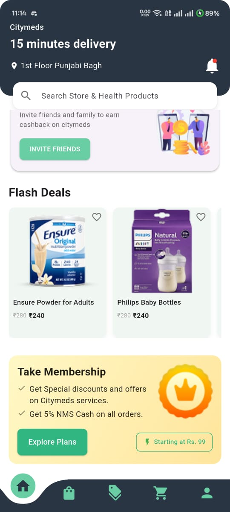
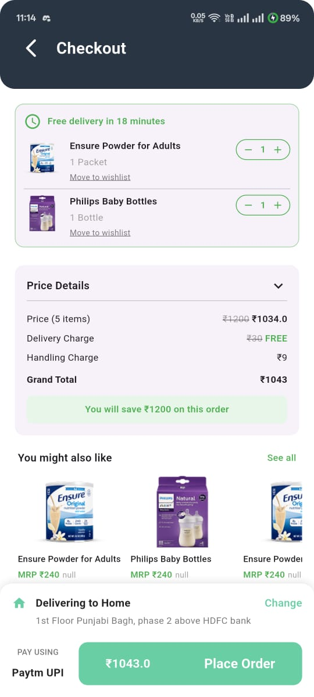

# 🏥 City Meds  


---

A **basic online medicine purchase app** built using **Flutter**.  
City Meds provides a clean and simple UI for browsing medicines, adding them to the cart, and placing orders – similar to how you order food online.

---

## ✨ Features
- 🏠 **Simple UI** for easy navigation  
- 📦 **Cart & Checkout** functionality  
- 🎨 **Reusable Widgets** for maintainability  
- 📱 **Smooth Page Indicator** for onboarding  
- 🧭 **Curved Bottom Navigation Bar** for modern UX  

---

## 🛠️ Tech Stack
- **Flutter (Dart)**
- **Provider** – State management
- **Smooth Page Indicator**
- **Curved Bottom Navigation Bar**
- **Reusable Widgets** for clean code

---

## 📱 Screenshots

### 🏠 Home Screens
<p>
  
  
  
</p>

### 🛒 Checkout Screen
<p>
  
</p>

---

## 🚀 Getting Started

### ✅ Prerequisites
- Install the **Flutter SDK** and set up your environment  
- An IDE like **Android Studio** or **VS Code**  
- An emulator/simulator or a physical device

### ✅ Steps to Run
1. **Clone the repository**
   ```bash
   git clone https://github.com/Aquib-ig/city_meds.git
   cd city_meds
   ```
2. **Install dependencies**
   ```bash
   flutter pub get
   ```
3. **(Optional) Verify your setup**
   ```bash
   flutter doctor
   ```
4. **Run the app**
   ```bash
   flutter run
   ```

### 📦 Build (optional)
- **Android (release APK)**
  ```bash
  flutter build apk --release
  ```
- **iOS (release)**
  ```bash
  flutter build ios --release
  ```
  > On macOS with Xcode configured.

---

## 👨‍💻 Author

**Aquib Khan**  
- GitHub: [Aquib-ig](https://github.com/Aquib-ig)  
- LinkedIn: [Aquib Khan](https://www.linkedin.com/in/aquib-khan-454049253)

---

## 📜 License
This project is available under the **MIT License**. Feel free to use and modify.
